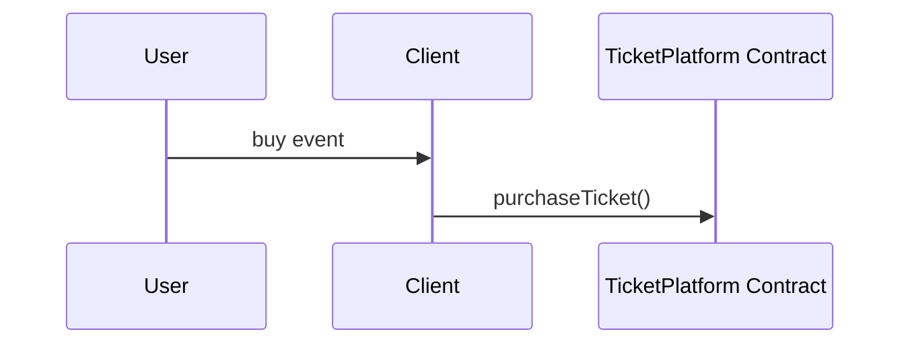
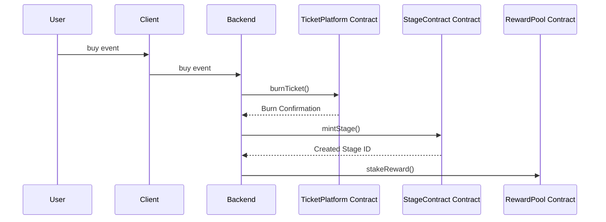
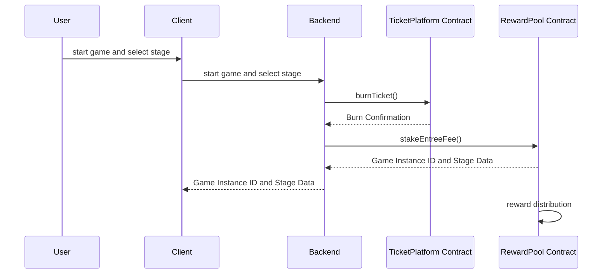
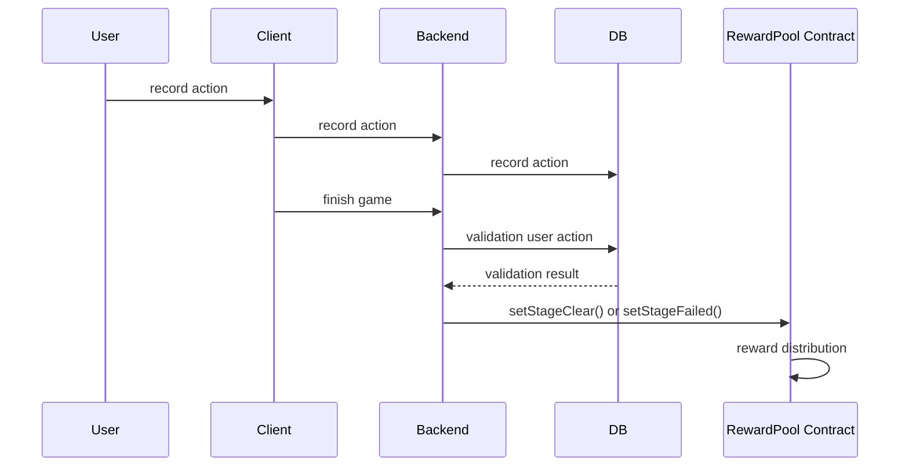
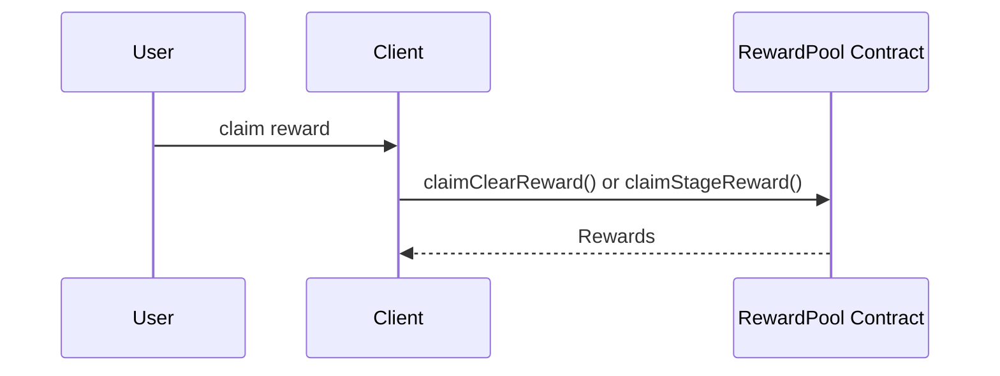

## Purchase tickets

```mermaid
sequenceDiagram
    participant A as User
    participant B as Client
    participant E as TicketPlatform Contract
    
    A ->> B: buy event
    B ->> E: purchaseTicket()

```

## Create stages

```mermaid
sequenceDiagram
    participant A as User
    participant B as Client
    participant C as Backend
    participant E1 as TicketPlatform Contract
    participant E2 as StageContract Contract
    participant E3 as RewardPool Contract
    
    A ->> B: buy event
    B ->> C: buy event
    C ->> E1: burnTicket()
    E1 -->> C: Burn Confirmation
    C ->> E2: mintStage()
    E2 -->> C: Created Stage ID
    C ->> E3: stakeReward()

```

## Paly stages

```mermaid
sequenceDiagram
    participant A as User
    participant B as Client
    participant C as Backend
    participant E1 as TicketPlatform Contract
    participant E2 as RewardPool Contract
    
    A ->> B: start game and select stage
    B ->> C: start game and select stage
    C ->> E1: burnTicket()
    E1 -->> C: Burn Confirmation
    C ->> E2: stakeEntreeFee()
    E2 -->> C: Game Instance ID and Stage Data
    C -->> B: Game Instance ID and Stage Data
    E2 ->> E2: reward distribution

```
## Stage flags on playing and finishing

```mermaid
sequenceDiagram
    participant A as User
    participant B as Client
    participant C as Backend
    participant D as DB
    participant E as RewardPool Contract
    
    A ->> B: record action
    B ->> C: record action
    C ->> D: record action
    B ->> C: finish game
    C ->> D: validation user action
    D -->> C: validation result
    C ->> E: setStageClear() or setStageFailed()
    E ->> E: reward distribution

``` 

## Claim reward

```mermaid
sequenceDiagram
    participant A as User
    participant B as Client
    participant E as RewardPool Contract
    
    A ->> B: claim reward
    B ->> E: claimClearReward() or claimStageReward()
    E -->> B: Rewards

    
```