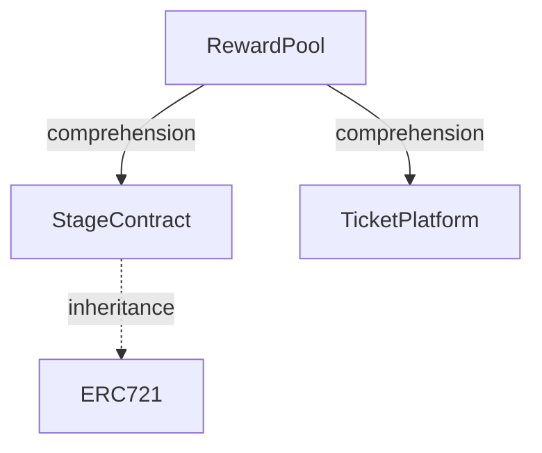

## Cotract abstarcts
| Contract Name  |  Description                                               |
| -------------- | ---------------------------------------------------------- |
| `RewardPool`   | Manages the reward distribution and staking mechanics for different game stages and clearances.            |
| `StageContract`| Manages the stage data using ERC721 tokens. |
| `TicketPlatform`| Manage the ticket types and user's ticket data.|

## Cotract Dependency

## Contract 1: RewardPool
| Function Name      | Access Modifier | Admin Only | Token Transfer | Description                                |
| ------------------ | --------------- | ---------- | -------------- | ------------------------------------------ |
| `stakeReward`      | `external`      | Yes        | Yes            | Stakes a reward for a particular stage, transferring the incentive minus fees from the Ticket Contract. |
| `stakeEntreeFee`   | `external`      | Yes        | Yes            | Stakes the entry fee for a game, transferring part of the staked amount to the stage owner and keeping part in the contract. Also, changes the game state to 'Started'.|
| `setStageClear`    | `external`      | Yes        | No             | Marks a game instance as cleared and transfers pending rewards to the clear rewards distribution. |
| `setStageFailed`   | `external`      | Yes        | No             | Marks a game instance as failed.           |
| `claimClearReward` | `external`      | No         | Yes            | Allows users to claim rewards after clearing a stage, transferring the reward to the user. |
| `claimStageReward` | `external`      | No         | Yes            | Allows users to claim rewards for a stage, transferring the reward to the user. |

## Contract 2: StageContract
| Function Name    | Access Modifier | Admin Only | Token Transfer | Description                               |
| ---------------- | --------------- | ---------- | -------------- | ----------------------------------------- |
| `mintStage`      | `external`      | Yes        | No             | Allows the admin to mint a new stage and store its data, providing various details about the stage, such as name, image URL, description, ticket requirements, and rewards upon completion. |
| `getAllStages`   | `external`        | No         | No             | Retrieves all stage IDs in existence. |
| `getStagesByOwner`| `external`        | No         | No             | Retrieves all stage IDs owned by the caller. |
| `getStageDetails`| `external`        | No         | No             | Retrieves the details of a specific stage. |

## Contract 3: TicketPlatform
| Function Name    | Access Modifier | Admin Only | Token Transfer | Description                                         |
| ---------------- | --------------- | ---------- | -------------- | --------------------------------------------------- |
| `setTicketPrice` | `external`      | Yes        | No             | Allows the admin to define new ticket types and set their prices and info.  |
| `purchaseTicket` | `external`      | No         | Yes            | Allows users to purchase a ticket by transferring tokens.                  |
| `burnTicket`     | `external`        | Yes        | No             | Allows the admin to burn a user's tickets, reducing their usable amount.   |
| `getUserTicket`  | `public`        | No         | No             | Retrieves the number of a specific type of tickets a user possesses.       |
| `getUsedTicket`  | `public`        | No         | No             | Retrieves the number of a specific type of tickets a user has used.        |
| `setUsedTicket`  | `internal`        | Yes        | No             | Allows the admin to manually set the number of used tickets for a user.     |
| `getDetails`     | `external`      | No         | No             | Retrieves the details of all available ticket types.                        |

