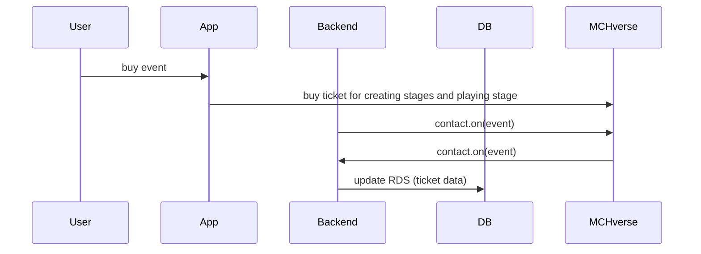
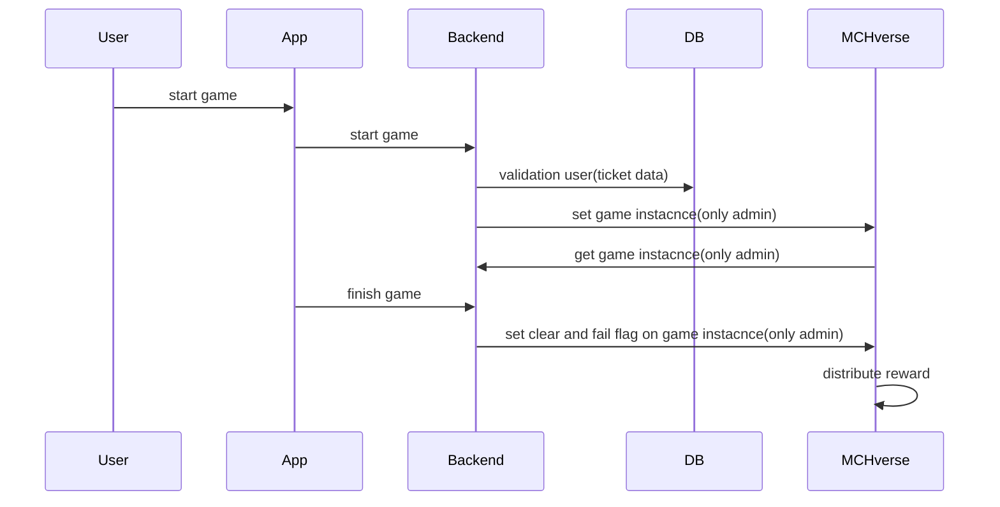
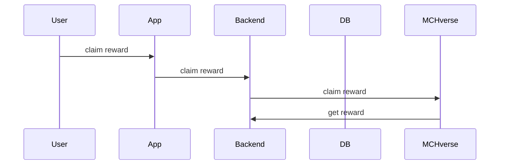

## Create Stages and paly stages

```mermaid
sequenceDiagram
    participant A as User
    participant B as App
    participant C as Backend
    participant D as DB
    participant E as MCHverse
    
    A ->> B: buy event
    B ->> E: buy ticket for creating stages and playing stage
    C ->> E: contact.on(event)
    E ->> C: contact.on(event)
    C ->> D: update RDS (ticket data)
```

## Stage flags

```mermaid
sequenceDiagram
    participant A as User
    participant B as App
    participant C as Backend
    participant D as DB
    participant E as MCHverse
    
    A ->> B: start game
    B ->> C: start game
    C ->> D: validation user(ticket data)
    C ->> E: set game instacnce(only admin)
    E ->> C: get game instacnce(only admin)
    
    B ->> C: finish game
    C ->> E: set clear and fail flag on game instacnce(only admin)
    
    E ->> E: distribute reward
``` 

## Claim reward

```mermaid
sequenceDiagram
    participant A as User
    participant B as App
    participant C as Backend
    participant D as DB
    participant E as MCHverse
    
    A ->> B: claim reward
    B ->> C: claim reward
    C ->> E: claim reward
    E ->> C: get reward
    
```