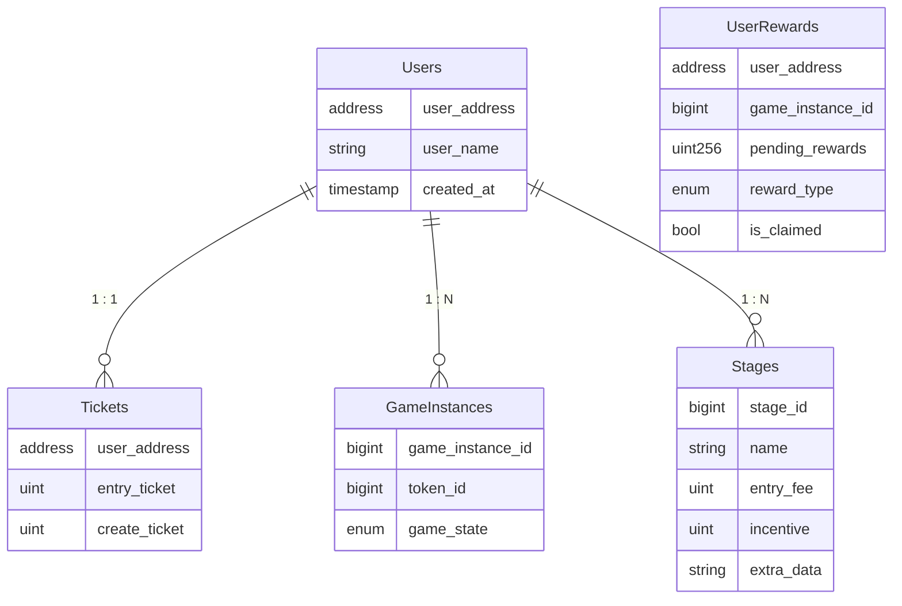

## ER Diagram

```mermaid
erDiagram
    Users ||--o{ Tickets : "1 : 1"
    Users ||--o{ GameInstances : "1 : N"
    Users ||--o{ Stages : "1 : N"
    
    Users {
        address user_address 
        string user_name 
        timestamp created_at 
    }

    Tickets {
        address user_address
        uint entry_ticket
        uint create_ticket
    }
    
    Stages {
        bigint stage_id
        string name 
        uint entry_fee 
        uint incentive 
        string extra_data 
    }
    
    
    GameInstances {
        bigint game_instance_id 
        bigint token_id 
        enum game_state 
    }

    UserRewards {
        address user_address 
        bigint game_instance_id 
        uint256 pending_rewards 
        enum reward_type 
        bool is_claimed 
    }


```