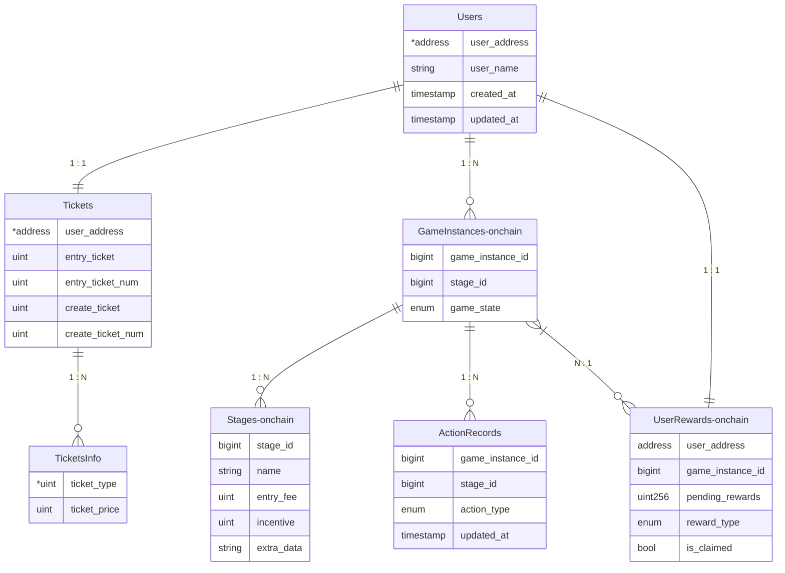

## ER Diagram ※コントラクト含むデータ形式のため正確に異なる

```mermaid
erDiagram
    Users ||--|| Tickets : "1 : 1"
    Tickets ||--o{ TicketsInfo : "1 : N"
    Users ||--o{ GameInstances-onchain : "1 : N"
    GameInstances-onchain ||--o{ Stages-onchain : "1 : N"
    GameInstances-onchain ||--o{ ActionRecords : "1 : N"
    Users ||--|| UserRewards-onchain : "1 : 1"
    GameInstances-onchain}|--o{ UserRewards-onchain : "N : 1"
    
    Users {
        *address user_address 
        string user_name 
        timestamp created_at 
        timestamp updated_at 
    }

    Tickets {
        *address user_address
        uint entry_ticket
        uint entry_ticket_num
        uint create_ticket
        uint create_ticket_num
    }
    
    TicketsInfo {
        *uint ticket_type
        uint ticket_price
    }
    
    Stages-onchain {
        bigint stage_id
        string name 
        uint entry_fee 
        uint incentive 
        string extra_data 
    }
    
    
    GameInstances-onchain {
        bigint game_instance_id 
        bigint stage_id 
        enum game_state 
    }

    ActionRecords {
        bigint game_instance_id 
        bigint stage_id 
        enum action_type 
        timestamp updated_at 
    }

    UserRewards-onchain {
        address user_address 
        bigint game_instance_id 
        uint256 pending_rewards 
        enum reward_type 
        bool is_claimed 
    }


```